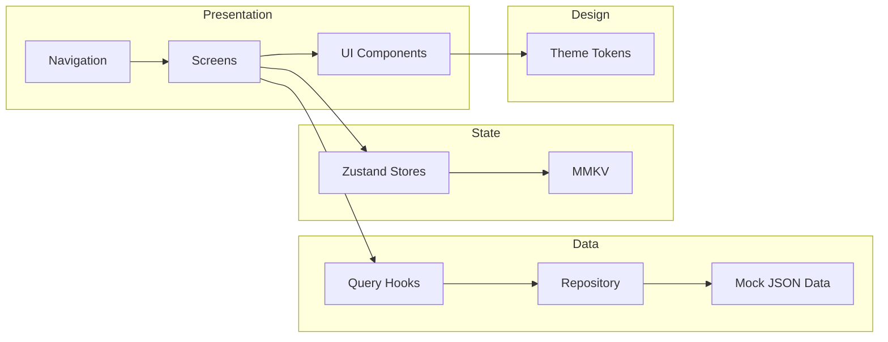

# Lyric Library

A React Native + Expo app for browsing artists, songs, and lyrics with a clean, wireframe-accurate UI.

## Quick start

```bash
npm install
npx expo start
```

For full setup details, see [SETUP.md](SETUP.md).

## Architecture overview



More details in [ARCHITECTURE.md](ARCHITECTURE.md).

## Tech stack

- React Native + Expo SDK 52
- TypeScript (strict)
- React Navigation (tabs + stacks)
- TanStack Query (server state)
- Zustand + MMKV (local state)
- FlashList (performance lists)
- Jest + Testing Library

## Intern onboarding checklist

- [ ] Read [SETUP.md](SETUP.md)
- [ ] Read [ARCHITECTURE.md](ARCHITECTURE.md)
- [ ] Read [CODING_STANDARDS.md](CODING_STANDARDS.md)
- [ ] Review [SPRINT_BACKLOG.md](SPRINT_BACKLOG.md)
- [ ] Run `npm test` and `npm run typecheck`
- [ ] Create a feature branch: `feature/S2-XX-short-description`

## Docs

- [SETUP.md](SETUP.md)
- [ARCHITECTURE.md](ARCHITECTURE.md)
- [CODING_STANDARDS.md](CODING_STANDARDS.md)
- [docs/DESIGN_TOKENS.md](docs/DESIGN_TOKENS.md)
- [docs/COMPONENTS.md](docs/COMPONENTS.md)
- [docs/BRANCH_WORKFLOW.md](docs/BRANCH_WORKFLOW.md)
- [docs/TROUBLESHOOTING.md](docs/TROUBLESHOOTING.md)
